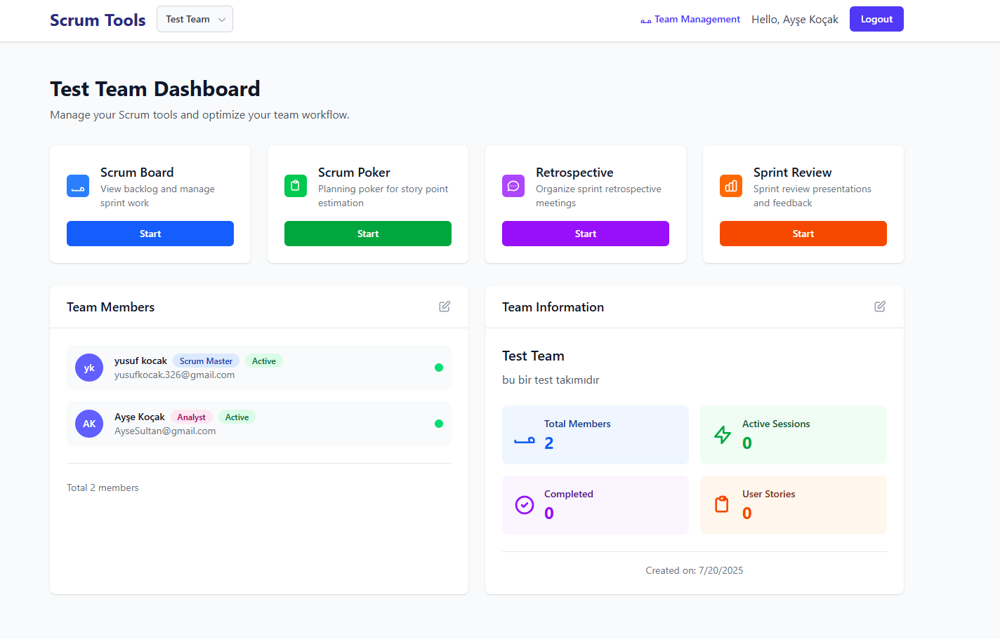
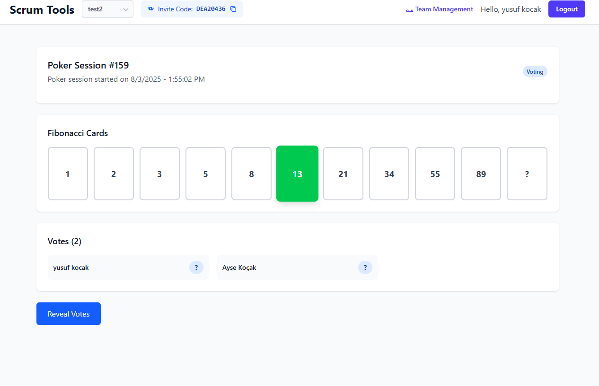
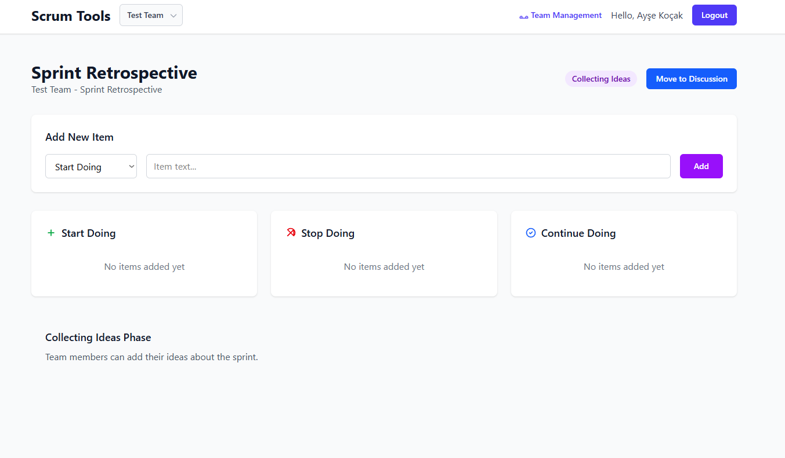

# Scrum Tools

A comprehensive web application for managing Scrum processes, including Planning Poker, Sprint Retrospectives, and team management features.

## 🚀 Features

### Core Functionality
- **Team Management**: Create and join teams with invite codes
- **User Authentication**: Secure login and registration system
- **Role-based Access**: Different permissions for Admin, Scrum Master, Developer, etc.

### Scrum Tools
- **Planning Poker**: Real-time story point estimation with Fibonacci cards
- **Sprint Retrospectives**: Start/Stop/Continue format retrospective sessions
- **Team Dashboard**: Overview of team members, statistics, and ongoing activities

### Real-time Features
- **WebSocket Integration**: Live updates for poker sessions and team activities
- **Multi-user Sessions**: Collaborative planning and retrospective sessions
- **Real-time Voting**: Instant vote updates and result calculations

## 🛠️ Technology Stack

- **Frontend**: React 18 + TypeScript
- **Build Tool**: Vite
- **Styling**: Tailwind CSS
- **State Management**: React Hooks
- **Real-time Communication**: WebSocket
- **Routing**: React Router
- **Icons**: Heroicons (SVG)

## 📋 Prerequisites

- Node.js (v16 or higher)
- npm or yarn package manager
- Modern web browser with WebSocket support

## 🚀 Getting Started

### Installation

1. **Clone the repository**
   ```bash
   git clone <repository-url>
   cd scrum-tools
   ```

2. **Install dependencies**
   ```bash
   npm install
   ```

3. **Start development server**
   ```bash
   npm run dev
   ```

4. **Open your browser**
   Navigate to `http://localhost:5173`

### Available Scripts

- `npm run dev` - Start development server
- `npm run build` - Build for production
- `npm run preview` - Preview production build
- `npm run lint` - Run ESLint

## 🏗️ Project Structure

```
src/
├── components/          # Reusable UI components
│   ├── DashboardHeader.tsx
│   ├── PokerSessionComponent.tsx
│   ├── TeamActionModal.tsx
│   └── ...
├── pages/              # Page components
│   ├── Dashboard.tsx
│   ├── Login.tsx
│   ├── RetrospectivePage.tsx
│   └── ...
├── services/           # API and business logic
│   ├── authService.ts
│   ├── teamService.ts
│   ├── pokerApiService.ts
│   └── ...
└── App.tsx            # Main application component
```

## 🎯 Usage

### Getting Started
1. **Sign Up**: Create a new account or log in
2. **Create/Join Team**: Create a new team or join existing one with invite code
3. **Start Using Tools**: Access Planning Poker, Retrospectives, and other Scrum tools

### Planning Poker
1. Navigate to your team dashboard
2. Click "Start" on the Scrum Poker card
3. Create a new session or join existing one
4. Vote using Fibonacci cards (1, 2, 3, 5, 8, 13, 21, 34, 55, 89, ?)
5. Reveal votes and see statistics
6. Set final estimate and complete session

### Sprint Retrospectives
1. Click "Start" on the Retrospective card
2. Add items to Start Doing, Stop Doing, or Continue Doing
3. Progress through phases: Collecting → Discussion → Voting → Completed
4. Vote on most important items
5. Complete retrospective with action items

### Team Management
1. **Admin Users**: Can approve/reject pending members
2. **Invite Codes**: Share 8-character codes for team joining
3. **Role Assignment**: Assign roles like Developer, Tester, Scrum Master, etc.

## 🔧 Configuration

### Environment Variables
Create a `.env` file in the root directory:

```env
VITE_API_BASE_URL=your_backend_api_url
VITE_WS_BASE_URL=your_websocket_url
```

### Backend Integration
This frontend expects a REST API backend with the following endpoints:

- `POST /auth/login` - User authentication
- `POST /auth/signup` - User registration
- `GET /teams` - Get user teams
- `POST /teams` - Create new team
- `POST /teams/join` - Join team by invite code
- `GET /poker/sessions/:teamId` - Get active poker session
- `POST /poker/sessions` - Create poker session
- WebSocket endpoints for real-time features

## 🎨 UI/UX Features

- **Responsive Design**: Works on desktop, tablet, and mobile
- **Dark Mode Ready**: Built with Tailwind CSS for easy theming
- **Accessibility**: Proper ARIA labels and keyboard navigation
- **Loading States**: User-friendly loading and error states
- **Real-time Updates**: Instant feedback for all user actions





## 🧪 Testing

```bash
# Run tests (when implemented)
npm run test

# Run tests with coverage
npm run test:coverage
```

## 🚀 Deployment

### Production Build
```bash
npm run build
```

The `dist` folder will contain the production-ready files.

### Deployment Options
- **Vercel**: Connect your repository for automatic deployments
- **Netlify**: Drag and drop the `dist` folder
- **AWS S3**: Upload build files to S3 bucket with CloudFront
- **Docker**: Create container with Nginx to serve static files

## 🤝 Contributing

1. Fork the repository
2. Create your feature branch (`git checkout -b feature/amazing-feature`)
3. Commit your changes (`git commit -m 'Add some amazing feature'`)
4. Push to the branch (`git push origin feature/amazing-feature`)
5. Open a Pull Request

### Code Style
- Use TypeScript for type safety
- Follow React best practices
- Use Tailwind CSS for styling
- Write meaningful commit messages
- Add comments for complex logic

## 📝 API Documentation

### Authentication
All API requests require authentication token in the header:
```
Authorization: Bearer <your-jwt-token>
```

### WebSocket Events
- `JOIN_ROOM` - Join poker room
- `LEAVE_ROOM` - Leave poker room
- `VOTE_CAST` - Cast vote in poker session
- `VOTES_REVEALED` - Votes revealed event
- `SESSION_COMPLETED` - Session completion event

## 🐛 Troubleshooting

### Common Issues

**WebSocket Connection Failed**
- Check if backend WebSocket server is running
- Verify WebSocket URL in environment variables
- Check browser console for connection errors

**Authentication Issues**
- Ensure JWT token is valid and not expired
- Check API endpoint URLs
- Verify backend server is running

**Build Errors**
- Clear node_modules and reinstall: `rm -rf node_modules && npm install`
- Check for TypeScript errors: `npm run type-check`
- Update dependencies: `npm update`

## 📄 License

This project is licensed under the MIT License - see the [LICENSE](LICENSE) file for details.

## 👥 Authors

- **Your Name** - *Initial work* - [YourGitHub](https://github.com/yourusername)

## 🙏 Acknowledgments

- React team for the amazing framework
- Tailwind CSS for the utility-first CSS framework
- Vite for the fast build tool
- Heroicons for the beautiful icon set
- Open source community for inspiration and libraries

## 📞 Support

If you have any questions or need help, please:
- Open an issue on GitHub
- Contact the development team
- Check the documentation

---

**Happy Scrum-ing! 🎯**
